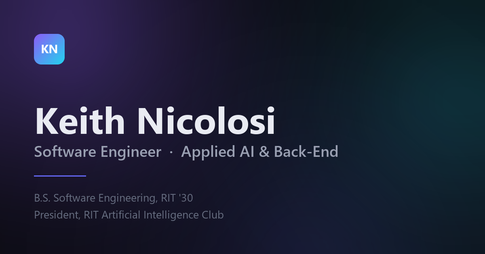

# Keith Nicolosi — Portfolio

My personal portfolio site. Hand-built with vanilla HTML, CSS, and JavaScript — no frameworks, no build step, no dependencies.

**Live:** [knicolosi313.github.io](https://knicolosi313.github.io)



---

## About

A single-page portfolio covering my background, selected projects, technical stack, and experience. The design is built around a dark "research lab" aesthetic: a deep void background with a slow-drifting aurora field, frosted glass panels, and film grain to keep the gradients from banding.

Everything is written by hand. There is no framework, no bundler, and no `node_modules` — the site is three files plus images, served exactly as they are written.

## Design

- **Aurora field** — three large blurred radial gradients drifting on 26s / 32s / 38s cycles at different rates, so the background never visibly loops. Transform-only animation, so it stays on the compositor.
- **Glass panels** — `backdrop-filter` with a top-edge highlight gradient, so panels catch light rather than looking like flat translucent boxes.
- **Pointer-tracked glow** — a soft light follows the cursor across the aurora. Disabled on touch devices and under reduced-motion.
- **Film grain** — an inline SVG `feTurbulence` layer at 3.2% opacity, deliberately placed *below* the content layer so it smooths gradient banding without softening text.

## Performance

Total first-load payload is **71 KB**:

| Asset | Size |
|---|---|
| `styles.css` | 24.4 KB |
| `index.html` | 18.7 KB |
| `me.webp` | 15.5 KB |
| `favicon.ico` | 6.4 KB |
| `script.js` | 6.0 KB |

The portrait is served as WebP with a JPEG fallback through `<picture>`, sized at 2× its display slot for retina. Images carry explicit dimensions to prevent layout shift.

## Accessibility

- Skip-to-content link
- Full `prefers-reduced-motion` support — animations, the aurora, and the pointer glow all disable
- Semantic landmarks, `aria-expanded` on the mobile nav toggle, labelled sections
- Visible focus rings on all interactive elements
- Keyboard-dismissable mobile navigation

The scroll-reveal animation degrades safely: above-the-fold content is revealed on load without relying on `IntersectionObserver`, and a failsafe reveals everything below the fold if the observer never reports — so the page can never be left blank if the API is suspended or unsupported.

## Structure

```
├── index.html          # All markup
├── styles/
│   └── styles.css      # All styles, design tokens at the top
├── javascript/
│   └── script.js       # Reveal, scrollspy, nav, pointer glow
├── images/             # Portrait, favicons, social card
├── site.webmanifest
└── README.md
```

## Running locally

The site uses relative paths, so you can open `index.html` directly in a browser. To serve it over HTTP instead:

```bash
npx serve .
```

## Deployment

Deployed via GitHub Pages from the `main` branch. No build step or CI configuration is required — GitHub serves the files as-is.

## Development

Designed and built from scratch, with layout, motion, and typography refined through AI-assisted, experimentation-driven iteration.

---

© 2026 Keith Nicolosi
